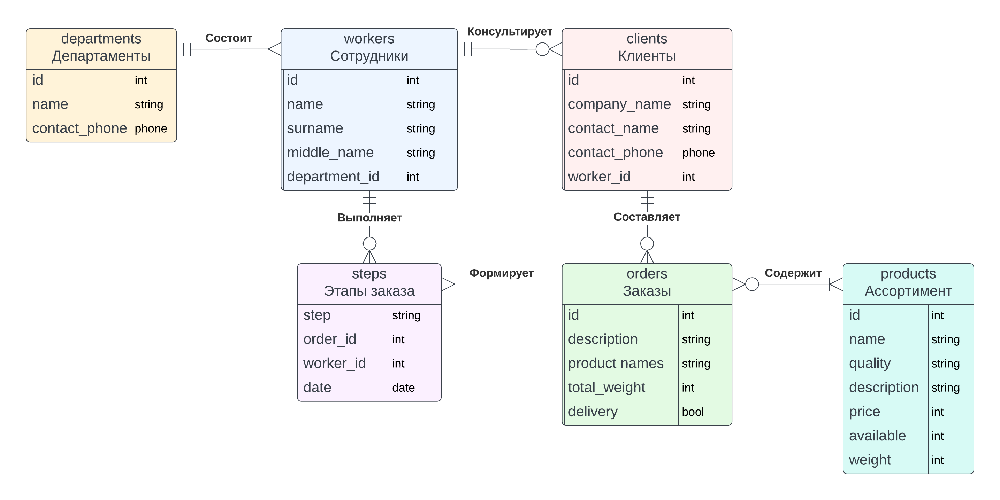

# База данных для поставщиков и покупателей металлопродукции и металлопроката.

## Прототип

### Средне-Уральская трубная компания

Сайт-визитка на гитхабе - [github](https://github.com/IgorFandre/golang-website)

Посмотреть запущенный сайт можно по [ссылке](https://sutk-igorfandre.amvera.io/).

## Концептуальное проектирование

### Предметная область: продажа металлопродукции

### Не детализированные сущности:
1. Сотрудники (с информацией: ID сотрудника, имя, фамилия, отчество, отдел)
2. Департаменты (с информацией: ID департамента, название, контактный телефон, контактная почта)
3. Клиенты (с информацией: ID клиента, название компании, контактное лицо, контактный телефон, ID менеджера, работающего с клиентом, адрес)
4. Заказы (с информацией: ID заказа, описание, товары, дата заказа, флаг самовывоза)
5. Этапы заказов (с информацией: ID этапа, ID заказа, исполнитель, даты начала и конца этапа)
6. Продукты (с информацией: ID товара, название, качество товара (номер ГОСТа), описание, цена единицы товара, количество на складе, вес единицы товара)

### Сущности будут связаны следующим образом:
1. В каждом департаменте не менее одного сотрудника (**один ко многим**).
2. На каждом этапе у заказа свой работник-исполнитель. Работник одновременно может брать этапы разных заказов (**один ко многим**).
3. У каждого клиента по одному менеджеру, привязанному к нему. Один менеджер может работать с несколькими клиентами (**один ко многим**).
4. У каждого заказа несколько этапов, обрабатываемых в определенном порядке (**один ко многим**).
5. Каждый заказ связан с одним клиентом, у клиента может быть много заказов (**один ко многим**).
6. Каждый заказ содержит товары и каждый товар может быть в нескольких заказах (**многие ко многим**).

### Схема 1:

### Схема 2:
