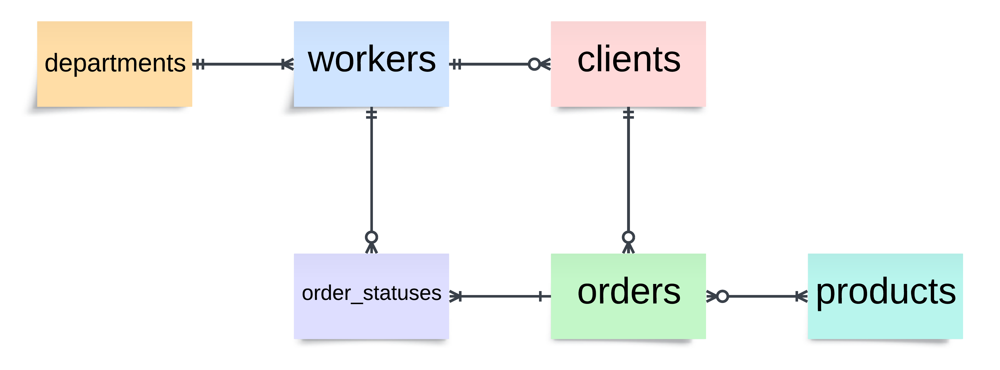

<h1 style="font-weight: bold; font-size: 24px;">База данных для поставщиков и покупателей металлопродукции и металлопроката</h1>

## Содержание

  
Открыть

- [Содержание](#содержание)
- [Прототип](#прототип)
  - [Средне-Уральская трубная компания](#средне-уральская-трубная-компания)
- [Концептуальное проектирование](#концептуальное-проектирование)
  - [Предметная область: продажа металлопродукции](#предметная-область-продажа-металлопродукции)
  - [Не детализированные сущности](#не-детализированные-сущности)
  - [Сущности связаны следующим образом](#сущности-связаны-следующим-образом)
  - [Схема модели](#схема-модели)
- [Логическое проектирование](#логическое-проектирование)
  - [Нормальная форма](#нормальная-форма)
  - [Версионирование](#версионирование)
  - [Схема модели](#схема-модели-1)
- [Физическое проектирование](#физическое-проектирование)
  - [Таблица: departments](#таблица-departments)
  - [Таблица: workers](#таблица-workers)
  - [Таблица: clients](#таблица-clients)
  - [Таблица: addresses](#таблица-addresses)
  - [Таблица: orders](#таблица-orders)
  - [Таблица: status\_types](#таблица-status_types)
  - [Таблица: order\_statuses](#таблица-order_statuses)
  - [Таблица: products](#таблица-products)
  - [Таблица: ordered\_products](#таблица-ordered_products)
- [Реализация базы данных](#реализация-базы-данных)
- [Представления баз данных в схеме sutk](#представления-баз-данных-в-схеме-sutk)
  - [Представление: physical\_entities](#представление-physical_entities)
  - [Представление: legal\_entities](#представление-legal_entities)
  - [Представление: storage](#представление-storage)
  - [Представление: orders\_progress](#представление-orders_progress)
- [Функции и процедуры](#функции-и-процедуры)
  - [Функция `delivery_info`](#функция-delivery_info)
  - [Функция `total_order_cost`](#функция-total_order_cost)
  - [Процедура `update_address`](#процедура-update_address)
  - [Процедура `delete_all_client_info`](#процедура-delete_all_client_info)
- [Тригеры](#тригеры)
  - [Триггер `check_product_availability_trigger`](#триггер-check_product_availability_trigger)
  - [Триггер `change_order_status_trigger`](#триггер-change_order_status_trigger)
  - [Триггер `delete_related_ordered_products_trigger`](#триггер-delete_related_ordered_products_trigger)

## Прототип

### Средне-Уральская трубная компания

Сайт-визитка на гитхабе - [github](https://github.com/IgorFandre/golang-website)

Посмотреть запущенный сайт можно по [ссылке](https://sutk-igorfandre.amvera.io/).

## Концептуальное проектирование

### Предметная область: продажа металлопродукции

### Не детализированные сущности
1. `Сотрудники` (с информацией: ID сотрудника, имя, фамилия, отчество, отдел)
2. `Департаменты` (с информацией: ID департамента, название, контактный телефон, контактная почта)
3. `Клиенты` (с информацией: ID клиента, название компании, контактное лицо, контактный телефон, ID менеджера, работающего с клиентом, адрес)
4. `Заказы` (с информацией: ID заказа, описание, товары, дата заказа, флаг самовывоза)
5. `Этапы заказов` (с информацией: ID этапа, ID заказа, исполнитель, даты начала и конца этапа)
6. `Продукты` (с информацией: ID товара, название, качество товара (номер ГОСТа), описание, цена единицы товара, количество на складе, вес единицы товара)

### Сущности связаны следующим образом
1. В каждом департаменте не менее одного сотрудника (**один ко многим**).
2. На каждом этапе у заказа свой работник-исполнитель. Работник одновременно может брать этапы разных заказов (**один ко многим**).
3. У каждого клиента по одному менеджеру, привязанному к нему. Один менеджер может работать с несколькими клиентами (**один ко многим**).
4. У каждого заказа несколько этапов, обрабатываемых в определенном порядке (**один ко многим**).
5. Каждый заказ связан с одним клиентом, у клиента может быть много заказов (**один ко многим**).
6. Каждый заказ содержит товары и каждый товар может быть в нескольких заказах (**многие ко многим**).

### Схема модели

## Логическое проектирование

### Нормальная форма

Модель находится в __3 нормальной форме__:

1. Атрибуты преобразованы к атомарным
   - Каждая ячейка хранит только одно значение
   - В колонках данные одного типа
   - Все записи отличаются друг от друга
2. Все неключевые атрибуты зависят от первичного ключа
3. Никакие колонки не зависят друг от друга

### Версионирование

В логической модели мы поддерживаем версионность адресов клиентов и для каждого заказа берем именно тот адрес, который был у него на момент заказа. Наш выбор - __SCD типа 2__, для которого мы заводим отдельную таблицу addresses, в которой храним id клиента и время начала и конца использования адреса.

### Схема модели

## Физическое проектирование

### Таблица: departments

| Название        | Описание              | Тип данных     | Ограничение               |
|-----------------|-----------------------|----------------|---------------------------|
| `department_id` | Идентификатор отдела  | `SERIAL`       | `PRIMARY KEY`             |
| `name`          | Название отдела       | `VARCHAR(50)`  | `NOT NULL`                |
| `phone`         | Телефон отдела        | `CHAR(16)`     | `LIKE '+7(___)___-__-__'` |
| `email`         | Email отдела          | `VARCHAR(50)`  | `LIKE '%_@__%.__%'`       |

### Таблица: workers

| Название       | Описание                     | Тип данных    | Ограничение   |
|----------------|------------------------------|---------------|---------------|
| `worker_id`    | Идентификатор работника      | `SERIAL`      | `PRIMARY KEY` |
| `department_id`| Идентификатор отдела         | `INTEGER`     | `FOREIGN KEY` | 
| `name`         | Имя работника                | `VARCHAR(20)` | `NOT NULL`    |
| `surname`      | Фамилия работника            | `VARCHAR(20)` | `NOT NULL`    |
| `middle_name`  | Отчество работника           | `VARCHAR(20)` |               |

### Таблица: clients

| Название         | Описание                      | Тип данных   | Ограничение               |
|------------------|-------------------------------|--------------|---------------------------|
| `client_id`      | Идентификатор клиента         | `SERIAL`     | `PRIMARY KEY`             |
| `worker_id`      | Идентификатор работника       | `INTEGER`    | `FOREIGN KEY`             |
| `company`        | Название компании клиента     | `VARCHAR(50)`| `UNIQUE`                  |
| `contact_name`   | Имя контактного лица клиента  | `VARCHAR(65)`| `NOT NULL`                |
| `contact_phone`  | Телефон контактного лица      | `CHAR(16)`   | `LIKE '+7(___)___-__-__'` |

### Таблица: addresses

| Название       | Описание                      | Тип данных     | Ограничение                     |
|----------------|-------------------------------|----------------|---------------------------------|
| `client_id`    | Идентификатор клиента         | `INTEGER`      | `FOREIGN KEY`                   |
| `address`      | Адрес клиента                 | `VARCHAR(200)` | `NOT NULL`                      |
| `from_date`    | Дата начала действия адреса   | `TIMESTAMP`    | `DEFAULT NOW()`                 |
| `to_date`      | Дата окончания действия адреса| `TIMESTAMP`    | `DEFAULT '5999-01-01 00:00:00'` |

### Таблица: orders

| Название       | Описание              | Тип данных     | Ограничение    |
|----------------|-----------------------|----------------|----------------|
| `order_id`     | Идентификатор заказа  | `SERIAL`       | `PRIMARY KEY`  |
| `client_id`    | Идентификатор клиента | `INTEGER`      | `FOREIGN KEY`  |
| `description`  | Описание заказа       | `TEXT`         |                |
| `delivery`     | Доставка              | `BOOLEAN`      | `NOT NULL`     |
| `order_date`   | Дата заказа           | `TIMESTAMP`    | `DEFAULT NOW()`|

### Таблица: status_types

| Название    | Описание              | Тип данных     | Ограничение   |
|-------------|-----------------------|----------------|---------------|
| `status_id` | Идентификатор статуса | `SERIAL`       | `PRIMARY KEY` |
| `name`      | Название статуса      | `VARCHAR(15)`  | `NOT NULL`    |

### Таблица: order_statuses

| Название          | Описание                              | Тип данных     | Ограничение            |
|-------------------|---------------------------------------|----------------|------------------------|
| `order_status_id` | Идентификатор статуса заказа          | `SERIAL`       | `PRIMARY KEY`          |
| `worker_id`       | Идентификатор работника               | `INTEGER`      | `FOREIGN KEY`          |
| `order_id`        | Идентификатор заказа                  | `INTEGER`      | `FOREIGN KEY`          |
| `status_id`       | Идентификатор статуса                 | `INTEGER`      | `FOREIGN KEY`          |
| `from_date`       | Дата начала статуса                   | `DATE`         | `DEFAULT CURRENT_DATE` |
| `to_date`         | Дата окончания статуса                | `DATE`         |                        |
| `comment`         | Комментарий                           | `TEXT`         |                        |
| `step_combination`| Комбинация `worker_id`, `order_id` и `status_id` для уникальности | | `UNIQUE`  |

### Таблица: products

| Название       | Описание                               | Тип данных        | Ограничение                |
|----------------|----------------------------------------|-------------------|----------------------------|
| `product_id`   | Идентификатор продукта                 | `SERIAL`          | `PRIMARY KEY`              |
| `name`         | Название продукта                      | `VARCHAR(50)`     | `NOT NULL`                 |
| `quality`      | Качество продукта                      | `VARCHAR(50)`     |                            |
| `description`  | Описание продукта                      | `TEXT`            |                            |
| `price`        | Цена продукта                          | `NUMERIC(10, 2)`  | `NOT NULL, price >= 0`     |
| `available`    | Количество доступных продуктов         | `INTEGER`         | `NOT NULL, available >= 0` |
| `weight`       | Вес продукта                           | `NUMERIC(10, 3)`  | `NOT NULL, weight >= 0`    |

### Таблица: ordered_products

| Название            | Описание                                              | Тип данных    | Ограничение           |
|---------------------|-------------------------------------------------------|---------------|-----------------------|
| `order_id`          | Идентификатор заказа                                  | `INTEGER`     | `FOREIGN KEY`         |
| `product_id`        | Идентификатор продукта                                | `INTEGER`     | `FOREIGN KEY`         |
| `count`             | Количество заказанных продуктов                       | `INTEGER`     | `NOT NULL, count > 0` |
| `order_combination` | Комбинация `order_id` и `product_id` для уникальности |               | `UNIQUE`              |

## Реализация базы данных

1) **[Cоздание базы данных](./sql_scripts/create.sql)**

2) **[Заполнение базы данных](./sql_scripts/insert.sql)**

3) **[Примеры запросов к базе данных](./sql_scripts/queries.md)**

## Представления баз данных в схеме sutk

### Представление: physical_entities

| Название          | Описание                                                     | Тип данных     |
|-------------------|--------------------------------------------------------------|----------------|
| `client_id`       | Идентификатор клиента                                        | `INTEGER`      |
| `client_name`     | Имя физического лица, являющегося клиентом                   | `VARCHAR(65)`  |
| `client_phone`    | Телефон контактного лица клиента                             | `CHAR(16)`     |
| `manager_name`    | Полное имя менеджера клиента                                 | `TEXT`         |
| `current_address` | Текущий адрес клиента или `NULL`, если адрес не указан       | `VARCHAR(200)` |

### Представление: legal_entities

| Название          | Описание                                                     | Тип данных     |
|-------------------|--------------------------------------------------------------|----------------|
| `client_id`       | Идентификатор клиента                                        | `INTEGER`      |
| `company`         | Название компании клиента                                    | `VARCHAR(50)`  |
| `client_name`     | Имя контактного лица клиента                                 | `VARCHAR(65)`  |
| `client_phone`    | Телефон контактного лица клиента                             | `CHAR(16)`     |
| `manager_name`    | Полное имя менеджера клиента                                 | `TEXT`         |
| `current_address` | Текущий адрес клиента или `NULL`, если адрес не указан       | `VARCHAR(200)` |

### Представление: storage

| Название      | Описание                                          | Тип данных    |
|---------------|---------------------------------------------------|---------------|
| `product_id`  | Идентификатор продукта                            | `INTEGER`     |
| `name`        | Название продукта                                 | `VARCHAR(50)` |
| `available`   | Количество доступных продуктов на складе          | `INTEGER`     |
| `booked`      | Количество забронированных продуктов              | `INTEGER`     |
| `free`        | Количество доступных незабронированных продуктов  | `INTEGER`     |

### Представление: orders_progress

| Название      | Описание                                        | Тип данных    |
|---------------|-------------------------------------------------|---------------|
| `order_id`    | Идентификатор заказа                            | `INTEGER`     |
| `client_name` | Имя клиента                                     | `VARCHAR`     |
| `status`      | Название статуса заказа                         | `VARCHAR(15)` |
| `status_date` | Дата установки статуса                          | `DATE`        |
| `order_date`  | Дата размещения заказа                          | `TIMESTAMP`   |

## Функции и процедуры

### Функция `delivery_info`

**Описание:**
Функция возвращает информацию о доставке заказа, включая общий вес заказа, количество требуемых машин и стоимость доставки.

**Параметры:**
- `ord_id` (INTEGER): идентификатор заказа
- `possible_weight` (NUMERIC(10, 3)): максимальный вес, который может уместиться в одной машине
- `one_car_cost` (NUMERIC(10, 2)): стоимость доставки одной машины

**Возвращаемые значения:**
- `total_weight` (NUMERIC(10, 3)): общий вес заказа
- `required_cars` (INTEGER): количество машин для доставки
- `delivery_cost` (NUMERIC(10, 2)): стоимость доставки

### Функция `total_order_cost`

**Описание:**
Функция вычисляет общую стоимость заказа, включая стоимость продуктов и доставки.

**Параметры:**
- `ord_id` (INTEGER): идентификатор заказа
- `possible_weight` (NUMERIC(10, 3)) DEFAULT NULL: максимальный вес, который может уместиться в одной машине (по умолчанию NULL)
- `one_car_cost` (NUMERIC(10, 2)) DEFAULT NULL: стоимость доставки одной машины (по умолчанию NULL)

**Возвращаемые значения:**
- `total_cost` (NUMERIC(10, 2)): общая стоимость заказа

### Процедура `update_address`

**Описание:**
Процедура обновляет адрес клиента и добавляет новую запись об адресе в таблицу `sutk.addresses`.

**Параметры:**
- `cl_id` (INTEGER): идентификатор клиента
- `new_address` (VARCHAR(200)): новый адрес клиента
- `new_address_date` (DATE) DEFAULT NOW(): дата нового адреса (по умолчанию - текущая дата)

### Процедура `delete_all_client_info`

**Описание:**
Процедура удаляет всю информацию о клиенте, включая адреса, статусы заказов, продукты в заказах и сами заказы.

**Параметры:**
- `clear_client_id` (INTEGER): идентификатор клиента, информацию о котором необходимо удалить

## Тригеры

### Триггер `check_product_availability_trigger`

**Описание:**
Этот триггер проверяет доступность продуктов на складе перед добавлением или обновлением информации о заказанных продуктах в таблице `sutk.ordered_products`. Если количество продуктов в заказе превышает количество доступных на складе, генерируется исключение "Not enough products available".

### Триггер `change_order_status_trigger`

**Описание:**
Данный триггер автоматически вычитает доступное количество товаров со склада при изменении статуса заказа на определенные значения (3 или 4). Он обновляет количество доступных продуктов в таблице `sutk.products` на основе информации о заказанных продуктах.

### Триггер `delete_related_ordered_products_trigger`

**Описание:**
Этот триггер автоматически удаляет информацию о заказанных продуктах из таблицы `sutk.ordered_products` при удалении соответствующего заказа из таблицы `sutk.orders`.
